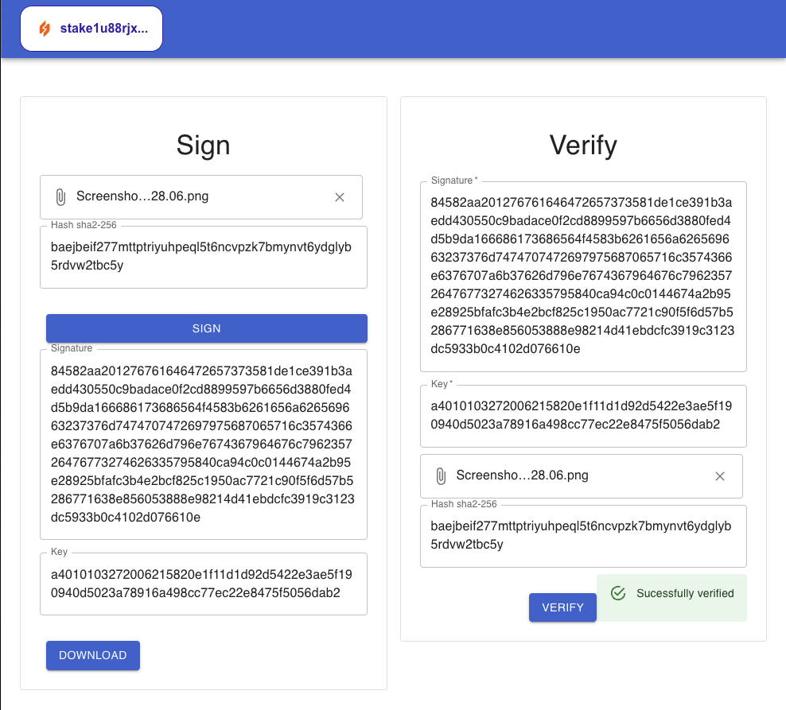

# SignSecure

SignSecure is an open-source React app built with TypeScript that allows users to securely upload, hash, and sign documents using a crypto wallet using Cardano's [CIP 8 - Message Signing](https://cips.cardano.org/cips/cip8/) and [CIP 30 - Cardano dApp-Wallet Web Bridge
](https://cips.cardano.org/cips/cip30/). It provides a user-friendly interface for document verification, ensuring data integrity and authenticity.



## Prerequisites

Before running SignSecure, please make sure you have the following prerequisites: 

- A crypto wallet extension installed in your browser for document signing. (e.g., Flint, Nami, Eternl).
- For running the app it's necessary to have npm or docker installed on your computer.

## Features

- Upload documents and calculate their hash using the `sha2-256` algorithm.
- Sign documents using a private key from a cardano crypto wallet.
- Verify document signatures by providing the corresponding signature and key and optionaly the orignal file to calculate again the original hash.

## Technologies Used

- React: A JavaScript library for building user interfaces.
- TypeScript: A typed superset of JavaScript that compiles to plain JavaScript.
- Material-UI (Mui): A popular React UI library for creating beautiful and responsive UI components.
- [Cardano connect with Wallet](https://github.com/cardano-foundation/cardano-connect-with-wallet): cardano-wallet-js is a javascript/typescript SDK for Cardano with several functionalities. It's library provides the functionality to connect a Cardano wallet and sign a documment using a key pair.
- [Cardano Verify Datasignature](https://github.com/cardano-foundation/cardano-verify-datasignature): A lightweight typescript library to verify a CIP 30 datasignature.
- [CIP 8 - Message Signing](https://cips.cardano.org/cips/cip8/)
- [CIP 30 - Cardano dApp-Wallet Web Bridge](https://cips.cardano.org/cips/cip30/)

## Installation

To run SignSecure locally, you have two options: using the Dockerfile or running it directly on your machine.

### Option 1: Using Docker (Recommended)

1. Clone the repository:

   ```bash
   git clone https://github.com/jorgenavben/SignSecure.git

2. Navigate to the project directory:

   ```bash
   cd SignSecure

3. Build the Docker image:

   ```bash
   docker build -t signsecure .

4. Run the Docker container:

   ```bash
   docker run -p 3000:3000 signsecure

5. Open your browser and visit http://localhost:3000 to see the application in action.


### Option 2: Running on Your Machine

1. Clone the repository:

   ```bash
    git clone https://github.com/jorgenavben/SignSecure.git

2. Navigate to the project directory:

   ```bash
   cd SignSecure

3. Install the dependencies:

   ```bash
   npm install

4. Start the development server:

   ```bash
   npm start

5. Open your browser and visit http://localhost:3000 to see the application in action.

## License
SignSecure is released under the MIT License. Feel free to use, modify, and distribute the code for personal and commercial purposes.